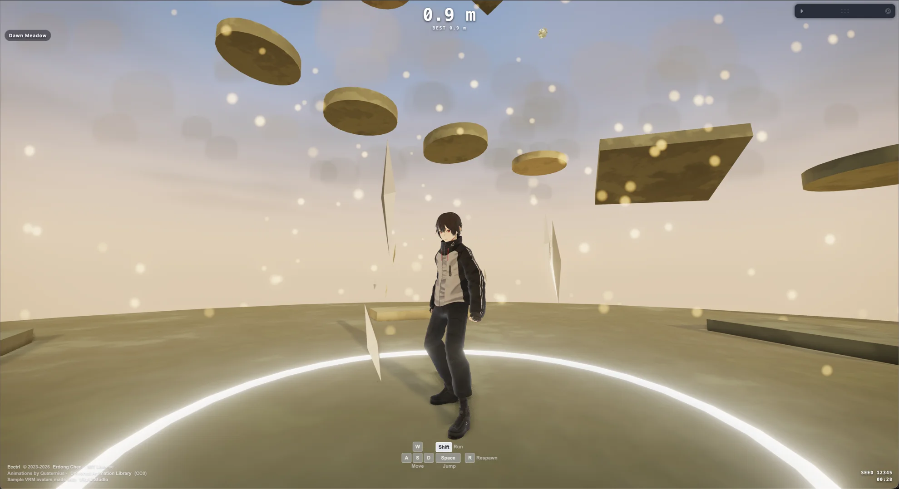

# ecctrl-vrm

[](./LICENSE)
[](https://threejs.org/)
[](https://github.com/pmndrs/react-three-fiber)
[](https://github.com/pmndrs/react-three-rapier)
[](https://github.com/pixiv/three-vrm)

**VRM avatar support for [Ecctrl](https://github.com/pmndrs/ecctrl)** — a fork of the physics-driven character controller for React Three Fiber and Rapier, extended so any VRM 0.x / VRM 1.0 avatar can be dropped in as the playable character.

Drag a `.vrm` file onto the demo and it walks, runs, jumps, and plants its feet on uneven terrain — animated by a shared humanoid animation library retargeted onto the avatar's bones at load time, rendered with MToon on three.js `WebGPURenderer`.

[](https://norio.github.io/ecctrl-vrm/)

**Live demo: [norio.github.io/ecctrl-vrm](https://norio.github.io/ecctrl-vrm/)** — climbing game at [/climb/](https://norio.github.io/ecctrl-vrm/climb/).

## Contents

- [What This Fork Adds](#what-this-fork-adds)
- [Demo Apps](#demo-apps)
- [VRM Pipeline](#vrm-pipeline)
  - [Loading and MToon on WebGPU](#loading-and-mtoon-on-webgpu)
  - [Animation Retargeting](#animation-retargeting)
  - [Locomotion State Mapping](#locomotion-state-mapping)
  - [Foot IK](#foot-ik)
  - [Drag & Drop Avatar Swap](#drag--drop-avatar-swap)
- [Using the Pipeline in Your Own Project](#using-the-pipeline-in-your-own-project)
- [Ecctrl Core](#ecctrl-core)
- [Local Development](#local-development)
- [Credits and License](#credits-and-license)

## What This Fork Adds

The Ecctrl library itself (`src/`) is kept in sync with upstream Ecctrl 2.0. The VRM integration lives in the example app (`example/vrm/`) as a self-contained, copyable reference implementation:

| Feature | Details |
| --- | --- |
| VRM 0.x and 1.0 loading | `@pixiv/three-vrm` loader plugin; VRM 0.x is normalized with `VRMUtils.rotateVRM0` automatically |
| MToon on WebGPU | `MToonNodeMaterial` (TSL node material) so toon shading works on `WebGPURenderer` |
| Runtime animation retargeting | One shared animation library GLB is retargeted onto each avatar's humanoid bones at load time — no per-avatar animation files |
| Ecctrl-driven locomotion | Ecctrl's animation states (`IDLE` / `WALK` / `RUN` / jump states) drive the retargeted clips with cross-fades and one-shot jump handling |
| Foot IK | Analytic two-bone leg IK with pelvis drop and ground-normal foot tilt, grounded by Rapier raycasts |
| Drag & drop avatar swap | Drop any `.vrm` onto the window to swap the playable character at runtime, with full disposal of the previous avatar |

## Demo Apps

Two entry points share the same VRM character pipeline:

- **`/` — Playground.** The upstream Ecctrl demo scene (characters, cars, drones, custom gravity) with a VRM avatar as the playable character. The Leva panel lets you switch the character model (VRM / Mannequin / Capsule), toggle foot IK, and load the bundled sample avatars.
- **`/climb` — Leap Up!** A procedural "Only Up!"-style climbing game built on the same controller and VRM rig, with keyboard, touch, and gamepad support.

Both run on three.js `WebGPURenderer` (initialized asynchronously in the `Canvas` `gl` callback).

## VRM Pipeline

All VRM code lives in [example/vrm/](example/vrm/):

| File | Role |
| --- | --- |
| [VrmCharacterModel.tsx](example/vrm/VrmCharacterModel.tsx) | Loads the VRM, sets up materials/shadows, owns the `AnimationMixer`, plays Ecctrl animation states, runs foot IK |
| [VrmAnimation.ts](example/vrm/VrmAnimation.ts) | Retargets humanoid animation clips from the source rig onto a VRM |
| [VrmAnimationContract.ts](example/vrm/VrmAnimationContract.ts) | Source-bone → VRM-humanoid-bone mapping and the rest-pose clip name (`A_TPose`) |
| [VrmTargetRestPose.ts](example/vrm/VrmTargetRestPose.ts) | Captures the target VRM's rest pose used by the retarget math |
| [FootIK.ts](example/vrm/FootIK.ts) | `CharacterFootIK` (pelvis drop + two-bone IK + foot tilt) and a reusable `solveTwoBoneIK` |
| [VrmDropTarget.tsx](example/vrm/VrmDropTarget.tsx) | Window-level `.vrm` drag & drop overlay |
| [useVrmStore.ts](example/vrm/useVrmStore.ts) | Current avatar URL/name (Zustand), revokes stale blob URLs |
| [VrmMeta.ts](example/vrm/VrmMeta.ts) | VRM 0.x detection |
| [VrmErrorBoundary.tsx](example/vrm/VrmErrorBoundary.tsx) | Keeps a failed avatar load from crashing the scene |

### Loading and MToon on WebGPU

The VRM is loaded through `GLTFLoader` with `VRMLoaderPlugin`, configured to build MToon materials as `MToonNodeMaterial` so they compile on WebGPU:

```tsx
const createVrmLoaderPlugin = (parser: GLTFParser) =>
  new VRMLoaderPlugin(parser, {
    mtoonMaterialPlugin: new MToonMaterialLoaderPlugin(parser, {
      materialType: MToonNodeMaterial,
    }),
  });

const gltf = useLoader(GLTFLoader, vrmUrl, (loader) => {
  loader.register(createVrmLoaderPlugin);
});
const vrm = gltf.userData.vrm as VRM;
```

After load, the model setup:

- enables shadows and disables frustum culling per mesh,
- forces `shadowSide = THREE.DoubleSide` on every material — the shadow pass renders all groups of a multi-material mesh through one shared override material, and mixed side values would trigger a WebGPU pipeline rebuild per group per frame,
- softens the MToon look for lit scenes (shade color lerped toward base color, parametric rim light).

`vrm.update(delta)` runs every frame after the mixer, so spring bones, constraints, and look-at all stay live.

### Animation Retargeting

Instead of shipping animations per avatar, one shared [public/AnimationLibrary.glb](public/AnimationLibrary.glb) (Quaternius' Universal Animation Library, CC0) is retargeted onto whichever VRM is loaded:

```tsx
if (isVrm0(vrm)) VRMUtils.rotateVRM0(vrm);
const clips = retargetHumanoidAnimationClips(animations, vrm, requiredClipNames);
```

How it works, in short:

1. The library's `A_TPose` clip defines the source rig's rest pose.
2. For each frame of each clip, the source bone's **world-space rotation delta from its rest pose** is computed, converted into the target VRM's space, and rewritten as a local quaternion track on the VRM's normalized humanoid bones.
3. The hips position track is carried over as a rest-pose-relative delta, so root motion (crouch, jump) survives.

The mapping between the source rig's bone names and VRM humanoid bones is a single table in [VrmAnimationContract.ts](example/vrm/VrmAnimationContract.ts) — full body plus all fingers. Avatars missing a *required* VRM humanoid bone fail fast with a descriptive error (caught by the error boundary); optional bones (fingers, toes, upper chest) are skipped gracefully.

Because retargeting goes through the VRM normalized humanoid, the same code path works for VRM 0.x (after `rotateVRM0`) and VRM 1.0, regardless of the avatar's proportions or rest-pose conventions.

### Locomotion State Mapping

Ecctrl's animation state store drives clip selection:

```tsx
const statusToActionMap = {
  IDLE: "Idle_Loop",
  WALK: "Walk_Loop",
  RUN: "Jog_Fwd_Loop",
  JUMP_START: "Jump_Start",
  JUMP_IDLE: "Jump_Loop",
  JUMP_FALL: "Jump_Loop",
  JUMP_LAND: "Jump_Land",
};
```

Loops cross-fade; `Jump_Start` / `Jump_Land` play as clamped one-shots that block re-triggering until they finish or the state moves on. The mixer respects the demo's global time scale and pause, so slow motion and pausing affect the avatar too.

### Foot IK

`CharacterFootIK` plants the avatar's feet on uneven terrain after the animation pose is applied:

1. A Rapier raycast (excluding sensors and the character's own body) samples the ground under each animated foot.
2. The pelvis is lowered so the downhill foot can reach.
3. An analytic two-bone IK per leg keeps each ankle at its animated height above the ground actually beneath it, preserving foot orientation.
4. Planted feet tilt to the ground normal (with slope and tilt limits); lifted feet blend out.
5. VRM node constraints (leg twist bones) are re-resolved after the IK adjustment.

Everything is damped and weight-blended, and the whole system fades out in the air. It only activates while `EcctrlHandle.isOnGround` is true, and can be toggled live from the Leva panel (`footIK`). The core solver is exported as a standalone `solveTwoBoneIK` if you only need the math.

### Drag & Drop Avatar Swap

`VrmDropTarget` listens on the window: drop a `.vrm` file anywhere and the store swaps the avatar URL (as an object URL). The previous avatar is fully torn down — mixer stopped and uncached, `VRMUtils.deepDispose` on the scene, loader cache cleared, stale blob URL revoked — so repeated swaps don't leak GPU memory. Non-VRM drops show a brief "Not a .vrm file" notice. Two VRoid Studio sample avatars ship in [public/](public/) and can be loaded from the Leva panel.

## Using the Pipeline in Your Own Project

The VRM layer is intentionally decoupled from the library: it only consumes public Ecctrl APIs (`EcctrlHandle`, `useEcctrlAnimationStore`, `EcctrlAnimationStateController`). To reuse it, copy `example/vrm/` and wire it like the demo does:

```tsx
const ecctrl = useRef<EcctrlHandle>(null);

<EcctrlAnimationStateController ecctrl={ecctrl} />
<Ecctrl ref={ecctrl}>
  <VrmErrorBoundary key={vrmUrl}>
    <Suspense fallback={null}>
      <VrmCharacterModel ecctrl={ecctrl} footIKEnabled />
    </Suspense>
  </VrmErrorBoundary>
</Ecctrl>
```

If you use your own animation library GLB, update the bone mapping and rest-pose clip name in [VrmAnimationContract.ts](example/vrm/VrmAnimationContract.ts) to match your source rig — that file is the only contract between the animations and the retargeter.

## Ecctrl Core

The controller library itself is unchanged from upstream Ecctrl 2.0: ShapeCast character controller, custom gravity, vehicles, drones, curve LUTs, touch input, time control, and the rest. For the full API, see:

- Upstream project: [pmndrs/ecctrl](https://github.com/pmndrs/ecctrl)
- [API and configuration guide](docs/api-reference.md)

## Local Development

```bash
npm install
npm run dev        # https dev server (vite + basic-ssl) — playground at /, climbing game at /climb/
npm run typecheck
npm run build:example
```

The dev server uses a self-signed certificate (`@vitejs/plugin-basic-ssl`); accept the browser warning on first load. A WebGPU-capable browser is recommended.

### GitHub Pages

Pushes to `main` build the example (`npm run build:example -- --base=/<repo>/`) and deploy it to GitHub Pages via [deploy-pages.yml](.github/workflows/deploy-pages.yml). Public assets are resolved through [example/assetUrl.ts](example/assetUrl.ts) (`import.meta.env.BASE_URL`), so the app works from the `/<repo>/` subpath. Enable it once in the repository settings: **Settings → Pages → Source: GitHub Actions**.

## Credits and License

- [Ecctrl](https://github.com/pmndrs/ecctrl) © 2023–2026 [Erdong Chen](https://github.com/ErdongChen-Andrew), MIT License. This fork keeps the same [MIT License](./LICENSE).
- VRM runtime: [@pixiv/three-vrm](https://github.com/pixiv/three-vrm) (MIT).
- Animations: [Quaternius — Universal Animation Library](https://quaternius.itch.io/universal-animation-library) (CC0).
- Sample VRM avatars made with [VRoid Studio](https://vroid.com/en/studio).
